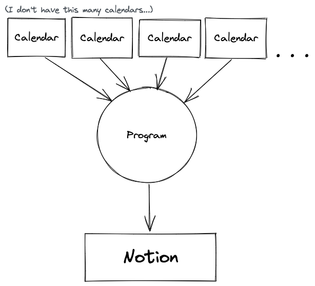
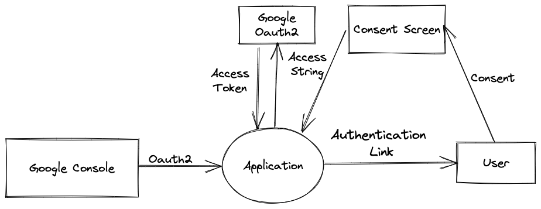
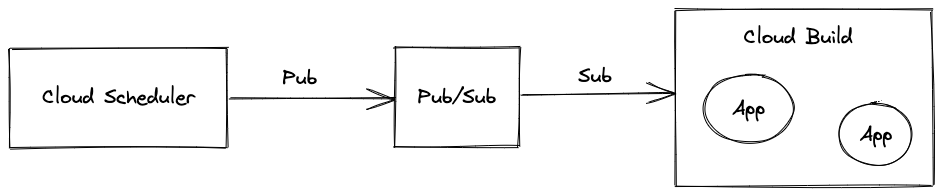
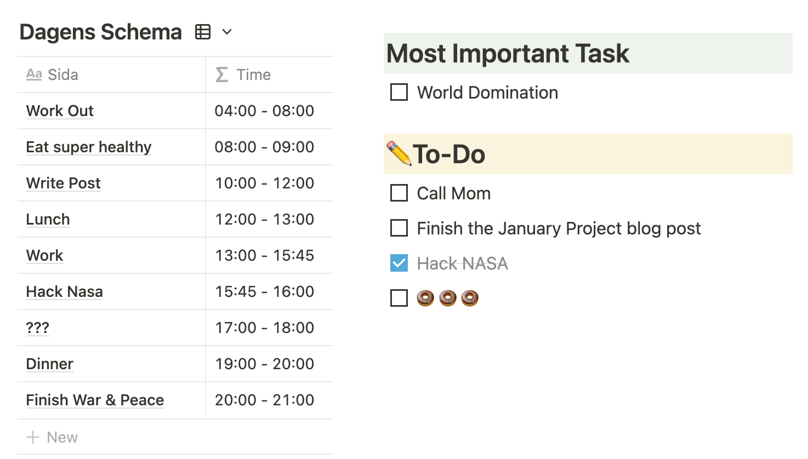

I use Notion for almost everything. I structure my work, make an abundance of
to-do lists, and I even jot down my favorite recipes. However, the one thing
that I still use other tools for is scheduling. The built-in calendar's lack of
granular planning, only letting you see a monthly overview, drives me nuts. And
the Google Calendar plugin looks like it was made in the early 00s. They just
don't do the trick for me.

I’ve tried to solve this by planning out my day in Google Calendar and importing
the events into Notion with Zapier. This works great - until my quota of "zaps"
runs out. Which they do. Every month. After about a week. So I will happily use
Notion for the first part of the month, then I’ll have to revert to using my
external calendar. Although annoying, it is not 20$ per month for a Zapier
subscription annoying.

With my Year of Projects getting off to a rough start (I had six exams in
January), I decided to take on an easier project to get back on track. And
building my own "zap" for importing Google Calendar events into Notion sounded
simple enough.

## The Plan

When I first thought about implementing this, the architecture was extremely
simple. Give an application the API keys to the calendars you want to import, as
well as the API key to your Notion database. Then just let the app stream the
events from the calendars into the Notion database. Set it on a timer and were
done!



## The Reality

Unfortunately, Google did not agree with me on this design. There are a lot more
hoops that you have to jump through to be able to use their Calendar API than
I’d anticipated. In the grander scheme of things, this is probably a good thing,
but in this case, it was quite annoying.

First of all, there are no API keys that you can download to get access to an
account's calendars. Instead, you have to set up a pair of Oauth2 credentials in
the cloud console. These can then be used to ask a user to give consent to the
app through a consent screen. The user is then presented with an access string
that they manually have to paste into the application (a web app could use a
redirect instead, but I was planning on running my application in GCP Cloud
Build). Finally, the application can exchange the access string for an access
token. The entire process looks something like this:



Oh, and you also have to tell the consent screens which emails should have
access to the application...

This authentication process made authenticating two different Google accounts
very non-intuitive. So, after looking for different ways of implementing my
original plan, I instead opted for only letting the application import events
from a single Google account. My revised architecture now looks like this:


## The Implementation

After settling on the simpler architecture I just had to implement the
application. After initializing the Calendar and Notion Clients we are able to
import and export the calendar events. Notion does not have an official Go SDK,
but there is an open-sourced implementation on GitHub that I used. It’s is being
actively maintained and supports the latest version of the API.

To make the code a bit more readable I created some abstractions for the API.
One function fetches all the events from the current day in Google Calendar,
another parse one of the events and exports it into the Notion database. A third
function speeds up the exporting by utilizing Gorutinies, thus making all the
parsing concurrent. All this abstraction reduces the Run function to this:

```go
func (a *App) Run(ctx context.Context) error {
	a.Logger.Info("running")
	title, err := a.NotionAPI.EnsureDatabase(ctx);
	if err != nil {
		return err
	}
	events, err := a.CalendarAPI.ListEvents()
	if err != nil {
		return err
	}
	a.NotionAPI.PutEvents(ctx, title, events)
	defer a.Logger.Info("stopped")
	return nil
}
```

## The Setup

Now that the code is working we just have to host it somewhere. As I said
earlier, the project was designed with the intent of hosting it on GCP. However,
the only thing that locks the application to GCP is the use of the Secret
Manager to store the API keys, but they could be stored in any other appropriate
way. Other than that I just use it because of familiarity.

The scheduling consists of a Cloud Scheduler that is set to send a Pub/Sub
message to a topic every day at midnight. This will in turn trigger the Cloud
Build where I have set up the applications twice, once for my personal calendar
and once for my work calendar. The workflow looks like this:



There we go! Now we have a master calendar, all without paying a dime. I have
noticed some bugs, mostly coming from unexpected behaviors with the Google
Calendar API. For instance, repeated events are not guaranteed to have the
correct date and can sometimes be fetched twice. Furthermore, the parsing of the
descriptions could be improved. However, for the time being, it’s good enough.

This is how it looks on my TODO page:



I glossed over quite a lot in this post, but all the code is available
[here](https://github.com/blaberg/google-calendar-to-notion) if you want to
check it out! There you can also find some more info on the different .env
variables that have to be set for it to work properly.

---

Edit 2022-03-09

So, I've had some problems with the app... Turns out I did not read the
documentation carefully enough.

> A Google Cloud Platform project with an OAuth consent screen configured for an
> external user type and a publishing status of "Testing" is issued a refresh
> token expiring in 7 days.

I guess I'll either have to put some more effort into the importer and make it a
proper app, or find another way to get Google Calendar into Notion. I'll keep
you guys notified!
